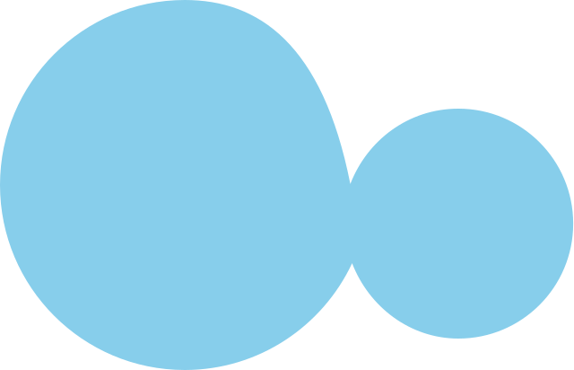

# KanbanWave

> Manage your tasks efficiently and flexibly - like a wave 🌊



**KanbanWave** is a tool designed to help manage tasks and projects using the Kanban method, ensuring that workflows move smoothly and flexibly like a wave.

- **Flexible** Intuitive drag-and-drop interface to easily manage boards, lists, and cards.
- **Efficient** Quickly reorganize tasks and maintain flow without breaking your momentum.
- **User-Friendly** A simple and clean design for smooth task management, from project overview to individual tasks.

## Features

- Board Management - Create, delete boards, and view all boards or specific boards.
- List Management - Create, delete lists within a board, and reorder lists.
- Card Management - Create, delete cards within a list, and reorder cards.
- Inline Editing - Edit board, list and card titles directly from the UI.
- List Movement (▤ ⇄ ▤) - Move lists horizontally within a board.
- Card Movement Between Lists (▤ ⇄ ▦) - Move cards between different lists.
- Card Movement Within a List (▦⇵▦) - Move cards vertically within the same list.

## Getting Started

### Install

```bash
npm install https://github.com/kwonhyunjeen/kanbanwave
```

### Sample Code

**Basic `KanbanWave` setup**

```tsx
import { KWStorageProvider, KWStorage } from 'kanbanwave';

function App() {
  const storage: KWStorage = { ... };

  return (
    <KWStorageProvider storage={storage}>
      {children}
    </KWStorageProvider>
  );
}
```

This code sets up the basic environment for using `KanbanWave` and acts as a context provider that injects the user-defined `storage`. The `storage` is an object that defines the API or database interactions with boards, lists, and cards.

**Displaying a List of Boards**

```tsx
import { BoardCollection } from 'kanbanwave';

function BoardList() {
  return <BoardCollection />;
}
```

A component that renders a collection of boards, allowing users to create and manage multiple boards.

**Viewing a specific board**

```tsx
import { BoardView } from 'kanbanwave';

function BoardContent() {
  return <BoardView />;
}
```

A component that displays the lists and cards within a selected board when a specific board is chosen.

## Usage

`KanbanWave` offers a range of features from storage integration to board display, theming, and component customization. You can manage your data by applying custom storage, easily display boards and lists, adjust the theme to fit your project, and customize how components are rendered based on your needs.

- [Integrate Storage](./docs/usage.md#integrate-storage)
- [Display Board Collection and Board](./docs/usage.md#display-board)
- [Customization](./docs/usage.md#customization)
- [Theming](./docs//usage.md#theming)
